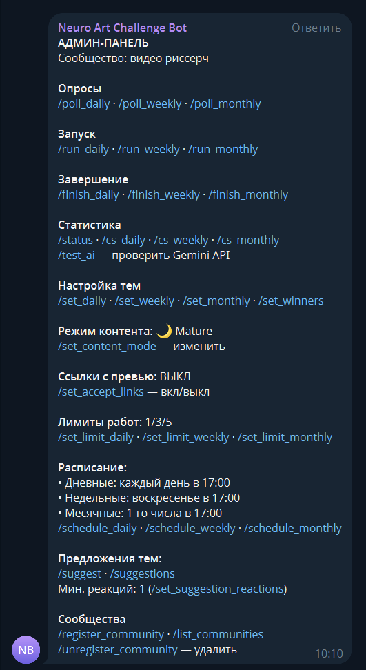

# 🎯 TG Challenge Bot

> Telegram-бот для проведения творческих челленджей в сообществах нейро-арта

[](https://opensource.org/licenses/MIT)
[](https://workers.cloudflare.com/)
[](https://core.telegram.org/bots)
[](https://ai.google.dev/)
[](https://github.com/timoncool/tg-challenge-bot/stargazers)
[](https://github.com/timoncool/tg-challenge-bot/network/members)



## ✨ Возможности

- 🏘️ **Мульти-сообщества**: один бот обслуживает до 10 групп
- 📅 **Три типа челленджей**: ежедневные, еженедельные, ежемесячные
- 🗳️ **Голосование за темы**: AI генерирует варианты, участники выбирают
- 🎨 **Простое участие**: просто отправьте картинку в тему челленджа
- 🔗 **Ссылки с превью**: опционально принимает ссылки как работы
- ⭐ **Подсчёт реакций**: автоматический подсчёт (🌚 не учитывается)
- 🏆 **Лидерборд**: рейтинг победителей (отдельный для каждой группы)
- 🚫 **Анти-плагиат**: пересланные изображения не принимаются
- 🧠 **Умный AI**: не повторяет темы (помнит последние 10)
- 💡 **Предложение тем**: участники могут предлагать свои темы
- 🎭 **Режимы контента**: vanilla / medium / nsfw
- ☁️ **Serverless**: работает на Cloudflare Workers (бесплатно!)

---

## 📋 Требования

- Telegram-группа с включёнными **темами (Topics)**
- Аккаунт [Cloudflare](https://cloudflare.com) (бесплатный)
- API-ключ [Google AI Studio](https://aistudio.google.com/apikey) (бесплатный)

---

## 🚀 Быстрая установка

### Шаг 1: Создайте бота в Telegram

1. Откройте [@BotFather](https://t.me/BotFather)
2. `/newbot` → введите имя → введите username
3. **Скопируйте токен** (например: `1234567890:ABCdefGHI...`)
4. `/mybots` → выберите бота → **Bot Settings** → **Group Privacy** → **Turn off**

### Шаг 2: Получите API-ключ Google AI

1. Откройте [Google AI Studio](https://aistudio.google.com/apikey)
2. **Create API Key** → скопируйте

### Шаг 3: Создайте Worker в Cloudflare

1. [Cloudflare Dashboard](https://dash.cloudflare.com) → **Workers & Pages** → **Create Worker**
2. Дайте имя (например: `challenge-bot`) → **Deploy**
3. **Edit Code** → вставьте код из `worker.js` → **Deploy**

### Шаг 4: Создайте KV хранилище

1. **Workers & Pages** → **KV** → **Create namespace**
2. Имя: `CHALLENGE_KV` → **Add**
3. Привяжите к Worker: **Settings** → **Bindings** → **Add** → **KV Namespace**
   - Variable name: `CHALLENGE_KV`

### Шаг 5: Добавьте секреты

**Settings** → **Variables and Secrets** → **Add** (тип: **Encrypt**):

| Имя | Значение | Обязательно |
|-----|----------|-------------|
| `BOT_TOKEN` | Токен от BotFather | ✅ Да |
| `GEMINI_API_KEY` | API-ключ Google AI | ✅ Да |
| `ADMIN_SECRET` | Любой пароль для HTTP API | ✅ Да |
| `WEBHOOK_SECRET` | Секрет для проверки webhook (любая строка) | ⬜ Нет |

> 💡 `WEBHOOK_SECRET` повышает безопасность, проверяя что запросы приходят именно от Telegram.

### Шаг 6: Настройте расписание

**Вариант A: Cron Triggers (Cloudflare)**

**Settings** → **Triggers** → **Cron Triggers**:

```
0 * * * *     — каждый час (проверяет расписание всех групп)
```

**Вариант B: Отложенные сообщения Telegram (проще!)**

Telegram поддерживает отложенные сообщения с повтором. Вместо Cron можно использовать сам Telegram как планировщик:

1. Напишите команду в группе (например `/poll_daily`)
2. Не отправляйте сразу — нажмите и удерживайте кнопку отправки
3. Выберите **"Запланировать сообщение"**
4. Установите время и **"Повторять: Ежедневно"**

Telegram будет автоматически отправлять команду по расписанию.

### Шаг 7: Активируйте webhook

Откройте в браузере:

```
https://ваш-worker.workers.dev/setup
```

Или используйте curl:

```bash
curl https://ваш-worker.workers.dev/setup
```

Если установлен `ADMIN_SECRET`:

```bash
curl -H "Authorization: Bearer ВАШ_ADMIN_SECRET" \
     https://ваш-worker.workers.dev/setup
```

Ответ при успехе:
```json
{"success": true, "webhook": "https://ваш-worker.workers.dev/webhook"}
```

### Шаг 8: Добавьте бота в группы

1. Добавьте бота в группу как **администратора**
2. Дайте права: удалять сообщения, закреплять, управлять темами
3. Напишите в группе: `/register_community`
4. Настройте топики — напишите в каждой теме:
   - `/set_daily` — в теме дневных челленджей
   - `/set_weekly` — в теме недельных
   - `/set_monthly` — в теме месячных
   - `/set_winners` — в теме победителей

### 🎉 Готово!

Повторите шаг 8 для каждой группы (до 10).

---

## 📱 Команды бота

### Для участников

| Команда | Описание |
|---------|----------|
| `/start`, `/help` | Справка по участию |
| `/stats` | Ваша статистика побед |
| `/leaderboard` | Топ-10 победителей |
| `/current` | Текущие активные челленджи |
| `/suggest Название \| Описание` | Предложить тему для челленджа |
| `/suggestions` | Список предложенных тем |

### Управление сообществами

| Команда | Описание |
|---------|----------|
| `/register_community` | Зарегистрировать группу |
| `/list_communities` | Список всех групп бота |
| `/unregister_community` | Удалить группу из бота |

### Настройка топиков

| Команда | Описание |
|---------|----------|
| `/topic_id` | Показать ID текущей темы |
| `/set_daily` | Назначить тему для дневных челленджей |
| `/set_weekly` | Назначить тему для недельных |
| `/set_monthly` | Назначить тему для месячных |
| `/set_winners` | Назначить тему для победителей |

### Настройки сообщества

| Команда | Описание |
|---------|----------|
| `/set_content_mode` | Режим контента: vanilla/medium/nsfw |
| `/set_accept_links on/off` | Принимать ссылки с превью как работы |
| `/set_suggestion_reactions N` | Минимум реакций для предложения (по умолчанию 3) |
| `/schedule_daily ЧАС` | Время дневных челленджей (UTC) |
| `/schedule_weekly ДЕНЬ ЧАС` | Время недельных (0=вс, 6=сб) |
| `/schedule_monthly ДЕНЬ ЧАС` | Время месячных |

### Управление челленджами

| Команда | Описание |
|---------|----------|
| `/admin` | Админ-панель со всеми командами |
| `/poll_daily` | Создать опрос дневного челленджа |
| `/poll_weekly` | Создать опрос недельного |
| `/poll_monthly` | Создать опрос месячного |
| `/run_daily` | Запустить дневной челлендж |
| `/run_weekly` | Запустить недельный |
| `/run_monthly` | Запустить месячный |
| `/finish_daily` | Завершить дневной |
| `/finish_weekly` | Завершить недельный |
| `/finish_monthly` | Завершить месячный |
| `/status` | Статус всех челленджей |
| `/cs_daily` | Статистика дневного челленджа |
| `/cs_weekly` | Статистика недельного |
| `/cs_monthly` | Статистика месячного |
| `/test_ai` | Проверить работу Gemini API |

---

## 🔧 Как это работает

### Цикл челленджа:

1. **Генерация** — AI создаёт темы, бот публикует опрос
2. **Голосование** — участники выбирают тему
3. **Старт** — опрос закрывается, объявляется тема-победитель
4. **Участие** — любое изображение в топике = участие
5. **Реакции** — участники оценивают работы (🌚 не считается)
6. **Итоги** — объявление победителя, пересылка в "Победители"

### Предложение тем:

Участники могут предлагать свои темы для челленджей:

1. **Предложение** — `/suggest Название | Описание`
2. **Голосование** — другие участники ставят реакции на понравившиеся предложения
3. **Одобрение** — темы с достаточным числом реакций попадают в следующий опрос
4. **Интеграция** — предложенные темы объединяются с AI-темами в опросе

Минимум реакций настраивается для каждой группы отдельно командой `/set_suggestion_reactions`.

### Мульти-сообщества:

- Каждая группа полностью изолирована
- Свои челленджи, лидерборды, настройки
- Один бот, один Worker, одна база KV
- Лимит: 10 групп

---

## 🌐 HTTP API

Все запросы требуют заголовок: `Authorization: Bearer {ADMIN_SECRET}`

### Эндпоинты

| Метод | Endpoint | Описание |
|-------|----------|----------|
| `GET` | `/` или `/health` | Проверка работоспособности |
| `GET` | `/setup` | Настройка webhook |
| `GET` | `/info` | Информация о всех сообществах |
| `GET` | `/admin/status` | Список всех сообществ |
| `GET` | `/admin/status?chat_id=ID` | Статус конкретного сообщества |
| `POST` | `/admin/poll/{type}?chat_id=ID` | Создать опрос (type: daily/weekly/monthly) |
| `POST` | `/admin/start/{type}?chat_id=ID` | Запустить челлендж |
| `POST` | `/admin/finish/{type}?chat_id=ID` | Завершить челлендж |

### Примеры curl

**Проверка работоспособности:**

```bash
curl https://ваш-worker.workers.dev/health
```

**Получить статус всех сообществ:**

```bash
curl -H "Authorization: Bearer ВАШ_СЕКРЕТ" \
     https://ваш-worker.workers.dev/admin/status
```

**Получить статус конкретного сообщества:**

```bash
curl -H "Authorization: Bearer ВАШ_СЕКРЕТ" \
     "https://ваш-worker.workers.dev/admin/status?chat_id=-1001234567890"
```

**Создать опрос дневного челленджа:**

```bash
curl -X POST \
     -H "Authorization: Bearer ВАШ_СЕКРЕТ" \
     "https://ваш-worker.workers.dev/admin/poll/daily?chat_id=-1001234567890"
```

**Запустить челлендж (закрыть опрос):**

```bash
curl -X POST \
     -H "Authorization: Bearer ВАШ_СЕКРЕТ" \
     "https://ваш-worker.workers.dev/admin/start/daily?chat_id=-1001234567890"
```

**Завершить челлендж (подвести итоги):**

```bash
curl -X POST \
     -H "Authorization: Bearer ВАШ_СЕКРЕТ" \
     "https://ваш-worker.workers.dev/admin/finish/daily?chat_id=-1001234567890"
```

**Получить информацию о сообществах:**

```bash
curl -H "Authorization: Bearer ВАШ_СЕКРЕТ" \
     https://ваш-worker.workers.dev/info
```

### Пример ответа `/admin/status?chat_id=...`

```json
{
  "chatId": -1001234567890,
  "challenges": {
    "daily": {
      "theme": "Киберпанк-город",
      "startedAt": "2025-01-15T10:00:00Z",
      "participants": 12
    },
    "weekly": null,
    "monthly": null
  },
  "polls": {
    "daily": false,
    "weekly": true,
    "monthly": false
  },
  "activeTopics": [123, 456]
}
```

---

## ❓ FAQ

### Бот не отвечает
1. Проверьте, что бот — администратор группы
2. Проверьте webhook: откройте `/setup`
3. Проверьте логи в Cloudflare Dashboard → Workers → Logs

### Как добавить новую группу?
Добавьте бота в группу → `/register_community` → настройте топики

### Как удалить группу?
В группе: `/unregister_community`

### Как получить ID топика?
Напишите `/topic_id` в нужной теме.

### Как получить ID группы (chat_id)?
Напишите `/register_community` — бот покажет ID группы.

### Как изменить время челленджей?
Через команды в группе:
- `/schedule_daily 17` — дневные в 17:00 UTC
- `/schedule_weekly 0 17` — недельные: воскресенье 17:00
- `/schedule_monthly 1 17` — месячные: 1-го числа в 17:00

### Сколько это стоит?
**$0** при обычном использовании:
- Cloudflare Workers: 100K запросов/день бесплатно
- KV: 100K операций/день бесплатно
- Google AI: бесплатный tier достаточен

---

## 📁 Файлы

| Файл | Описание |
|------|----------|
| `worker.js` | Чистый ванильный код — разверните и настройте под своё сообщество |
| `worker-mr-challenger.js` | Пример кастомизации с персонажем и стилем |

---

## 📄 Лицензия

MIT — используйте свободно!

---

## 🙏 Благодарности

- [Cloudflare Workers](https://workers.cloudflare.com/) — бесплатный serverless
- [Google AI](https://ai.google.dev/) — генерация тем через Gemini

---

Проект развивается [Nerual Dreaming](https://t.me/nerual_dreming) — основателем [ArtGeneration.me](https://artgeneration.me/), [техноблогером](https://www.youtube.com/@nerual_dreming) и нейро-евангелистом.

---

## ⭐ Star History

<a href="https://star-history.com/#timoncool/tg-challenge-bot&Date">
 <picture>
   <source media="(prefers-color-scheme: dark)" srcset="https://api.star-history.com/svg?repos=timoncool/tg-challenge-bot&type=Date&theme=dark&v=1" />
   <source media="(prefers-color-scheme: light)" srcset="https://api.star-history.com/svg?repos=timoncool/tg-challenge-bot&type=Date&v=1" />
   
 </picture>
</a>

