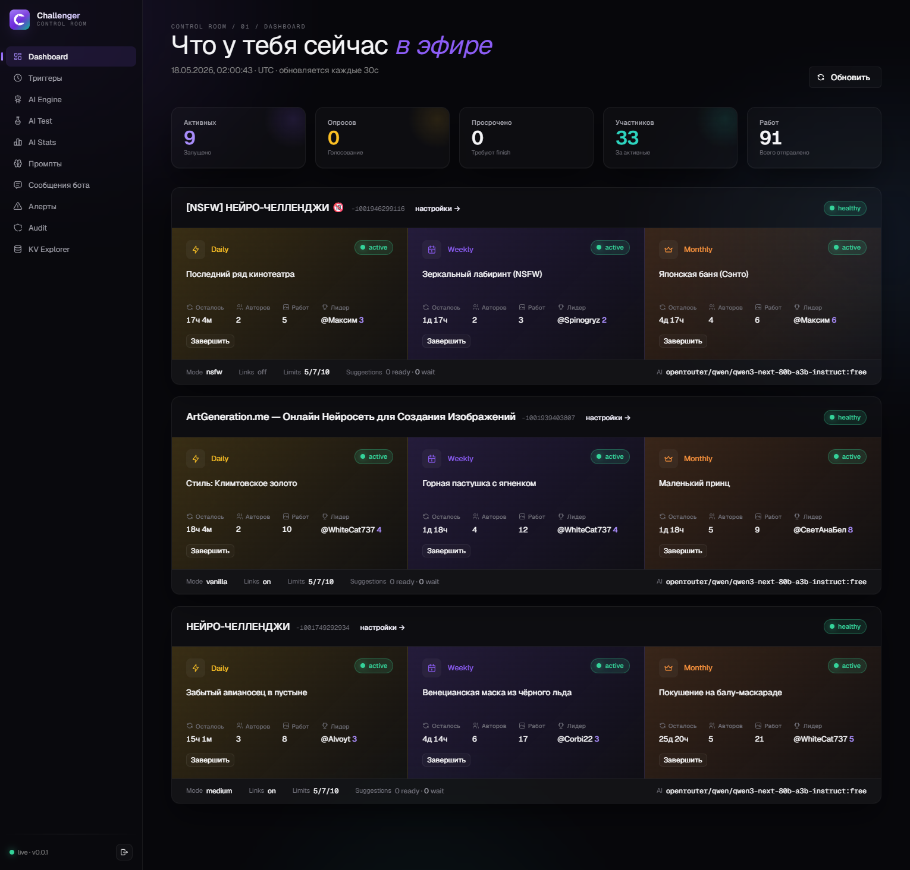
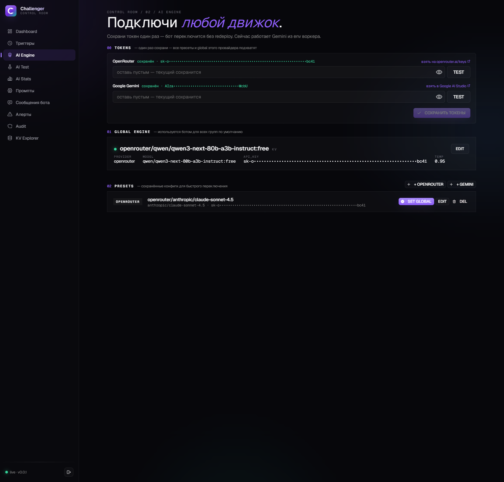
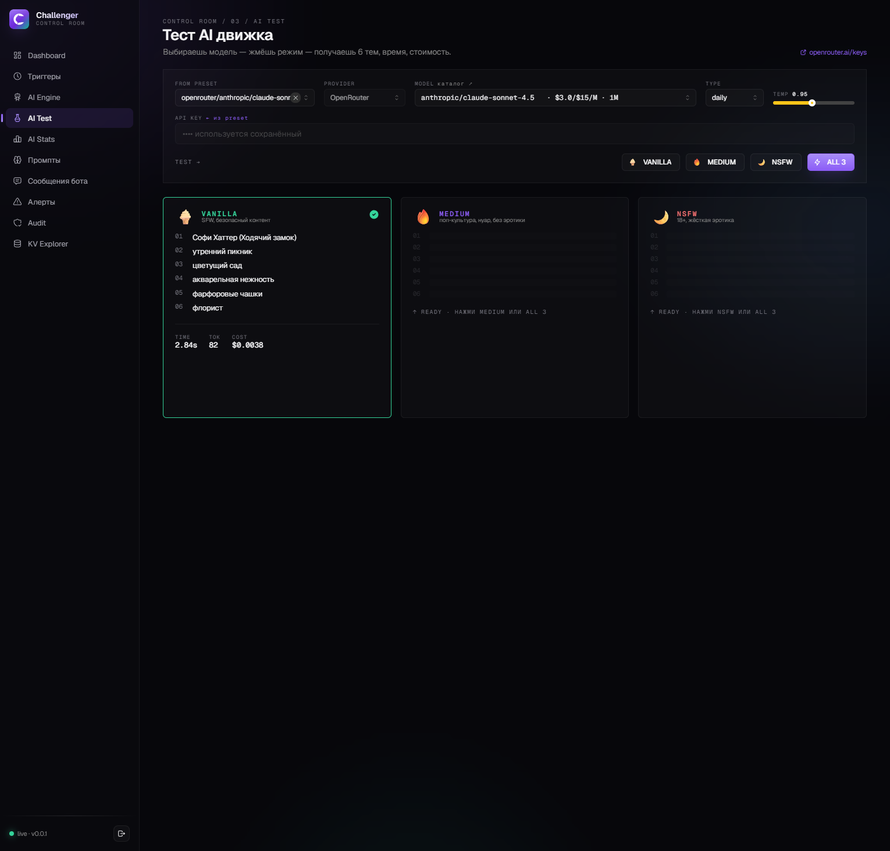
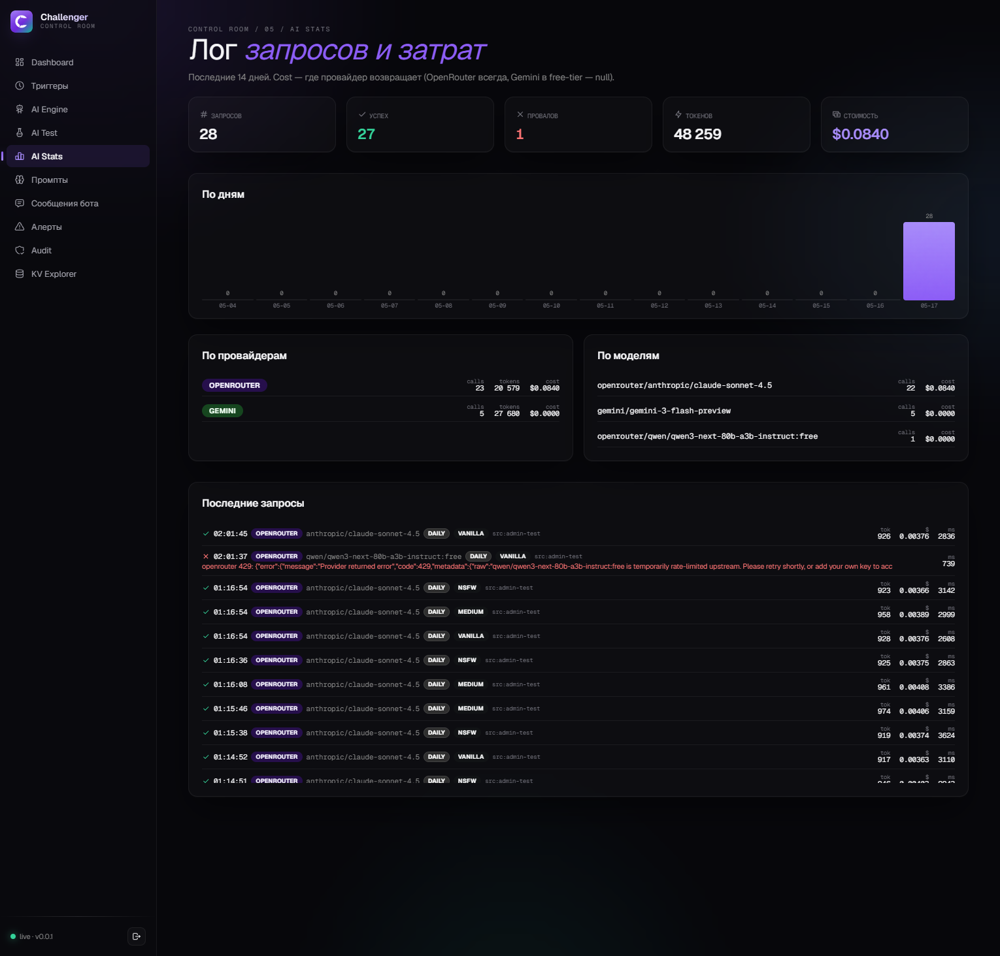
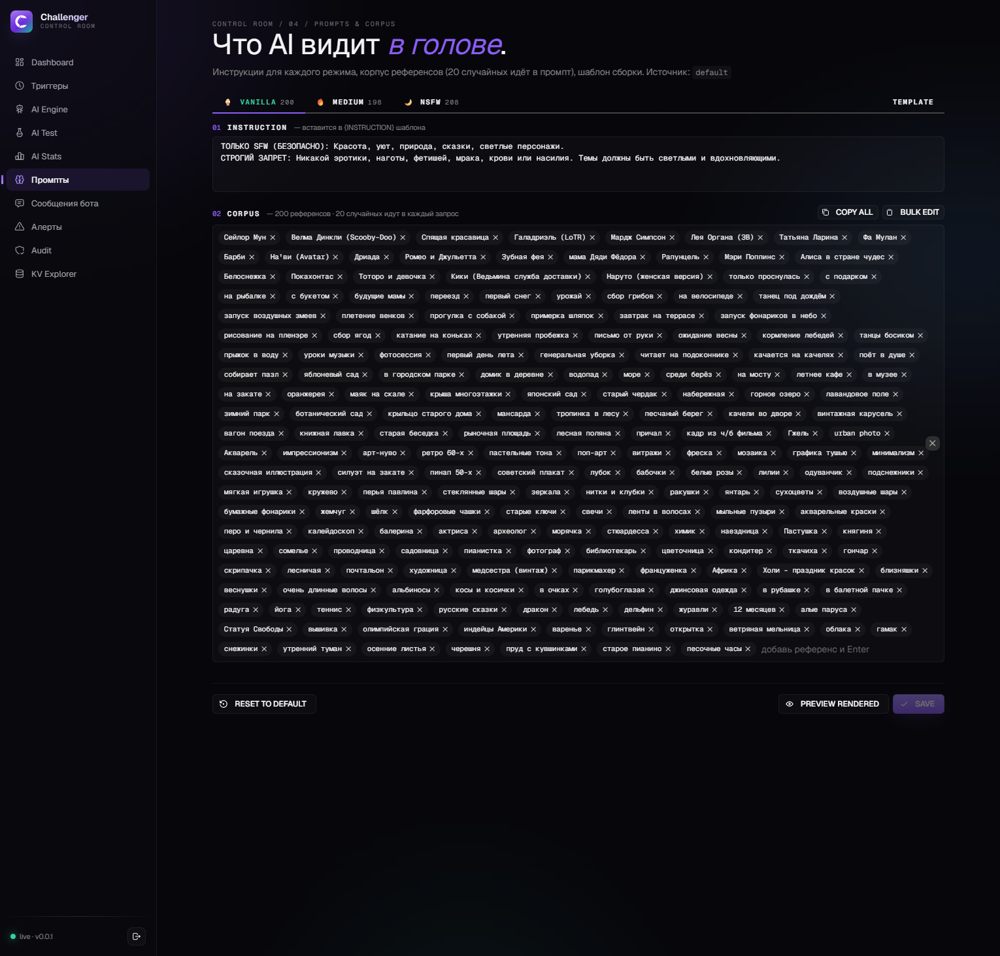
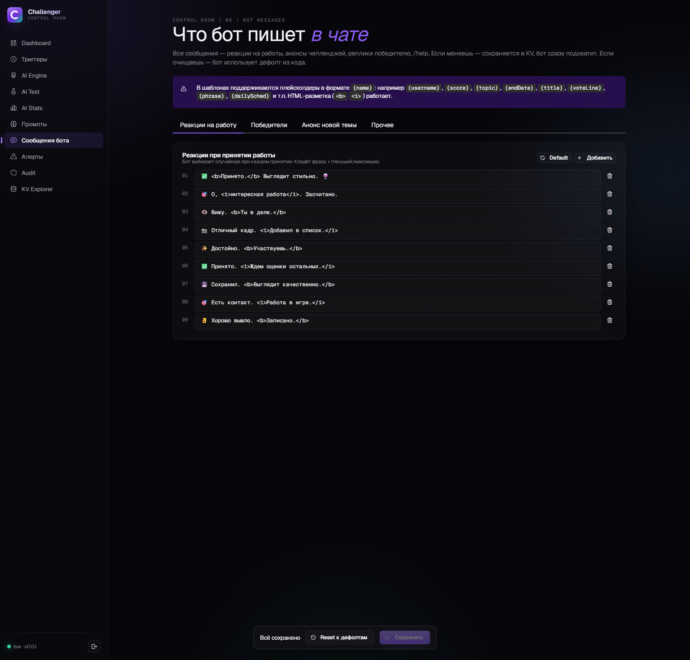

<div align="center">

# Challenger — Admin Panel for TG Challenge Bot

**Веб-админка для бота, живущего на Cloudflare Workers.**
Vite + React 19 + Mantine 9, бэк — Pages Functions, тот же KV что и у бота.



</div>

---

## Что это

Один Cloudflare Pages деплой, который:

- **видит всё что бот видит** — биндится напрямую в `CHALLENGE_KV`, никакого HTTP-моста, никаких задержек репликации
- **управляет AI** — Gemini и OpenRouter, токен каждого провайдера сохраняется один раз в секции `TOKENS` и автоматически подхватывается всеми presets и global. Hot-swap движка без redeploy бота.
- **выбирает модель по-человечески** — каталог OpenRouter сгруппирован по цене (🚀 Frontier · 💼 Standard · 💸 Budget · 🆓 Free), в каждой строке видно `$prompt/$compl за 1M токенов` и контекст. Поиск работает через все группы.
- **управляет расписанием с минутной точностью** — независимые `pollHour/pollMinute/pollDay` и `challengeHour/challengeMinute/challengeDay` для каждого community. Заменяет ручные scheduled-сообщения Telegram'а на Cloudflare cron triggers (`* * * * *` чтобы ловить минуту).
- **редактирует тексты бота** — все реплики на работы / победителей / анонсы лежат в KV, не в коде. Меняешь — бот сразу подхватывает.
- **редактирует корпус промптов массово** — кнопки `COPY ALL` и `BULK EDIT` на странице Prompts: копируешь весь корпус режима как `\n`-separated текст, правишь в любимом редакторе, вставляешь обратно. Дубликаты и пустые строки убираются автоматически.
- **тестирует AI** — гоняет vanilla / medium / nsfw на любой модели OpenRouter за 1 клик. После теста сразу видно время, токены и **реальную цену в USD** (для OpenRouter — через `usage: { include: true }`).
- **логирует** каждый AI-вызов с tokens + cost (и admin-тесты, и боевые вызовы бота — в одной таблице со `source`), каждый POST/PUT/PATCH через `/api/*` (append-only audit log с reverse-timestamp prefix).

## Скриншоты

| | |
|---|---|
| **Dashboard** — 3 группы в эфире, активные челленджи, опросы, лидеры | **AI Engine** — два токена сверху, presets для быстрого переключения |
|  |  |
| **AI Test** — 6 тем за секунды, видна цена и токены | **AI Stats** — лог запросов и затрат по дням / моделям |
|  |  |
| **Prompts** — инструкции и корпус референсов для каждого режима | **Messages** — все реплики бота редактируются из KV |
|  |  |

## Архитектура

```
┌────────────────────────────── Cloudflare Pages ──────────────────────────────┐
│                                                                              │
│   SPA (Vite + React + Mantine)                                               │
│           │                                                                  │
│           ▼                                                                  │
│   Pages Functions (functions/api/*.ts)  ◀───── HttpOnly cookie HMAC auth     │
│           │                                                                  │
│           │ direct binding                                                   │
│           ▼                                                                  │
│   ┌──────────────────────────┐         ┌───────────────────────────────┐     │
│   │ CHALLENGE_KV             │ ◀───────│ tg-challenge-bot worker        │     │
│   │ (общий с ботом)          │         │ ../worker-mr-challenger.js     │     │
│   └──────────────────────────┘         └───────────────────────────────┘     │
│                                                                              │
└──────────────────────────────────────────────────────────────────────────────┘
```

Один KV-namespace на всё — нет рассинхрона. Все изменения в админке бот видит немедленно при следующем обращении к KV.

## Стек

- **Frontend:** Vite 8, React 19, Mantine 9, TanStack Query 5, react-router 7
- **Backend:** Cloudflare Pages Functions (TypeScript)
- **Auth:** ADMIN_SECRET в форме → HMAC HttpOnly cookie (7 дней)
- **Стейт:** только KV. Никаких внешних БД.
- **Без `wrangler.toml`** — деплой через `wrangler pages deploy` с env-vars (см. ниже)

## Структура

```
admin/
├── src/                         # фронт
│   ├── pages/                   # каждая страница ≈ роут
│   ├── components/              # AppShell, BrandMark, PageHeader, OpenRouterCatalogModal
│   ├── lib/openrouter-groups.ts # категоризация моделей в Select по цене
│   ├── api/                     # тонкий fetch-клиент
│   └── hooks/                   # useAuth
├── functions/                   # Pages Functions = бэк
│   ├── _lib/                    # auth (HMAC cookie), audit log
│   └── api/                     # endpoints
│       ├── auth/                # /login /me /logout
│       ├── ai/                  # global, presets, tokens, test, prompts, openrouter-catalog
│       ├── communities/[chatId] # settings, challenges, leaderboard, suggestions, ai, trigger…
│       ├── cron/triggers.ts     # управление cron-расписанием бота
│       ├── kv/                  # explorer (keys + value)
│       ├── stats/ai.ts          # агрегаты затрат
│       ├── audit.ts             # лог админ-действий
│       └── messages.ts          # тексты бота
├── scripts/                     # без wrangler где можно
│   ├── pages-setup.mjs          # одноразовый setup CF Pages project + KV bindings
│   ├── pages-deploy.mjs         # direct upload через CF REST (без functions, см. ниже)
│   ├── kv-backup.mjs            # резервная копия KV в JSON
│   └── kv-restore.mjs           # обратно
├── public/favicon.svg
├── index.html
├── package.json
└── .env.example                 # шаблон, скопируй в .env.local
```

## Установка

### 1. Поставить зависимости

```bash
cd admin
npm install
```

### 2. Создать `.env.local`

```bash
cp .env.example .env.local
```

Заполнить:

```
# Cloudflare Account
CF_ACCOUNT_ID=…                            # https://dash.cloudflare.com/  (правый сайдбар)
CF_AUTH_EMAIL=…@gmail.com                  # email от CF
CF_AUTH_KEY=…                              # Global API Key из My Profile → API Tokens

# Worker, к которому биндимся (тот же что бот)
CF_WORKER=tg-challenge-bot
CF_KV_BINDING=CHALLENGE_KV

# Pages project (создаст pages-setup.mjs)
PAGES_PROJECT_NAME=tg-challenge-bot-admin

# Секрет для входа в админку (любая длинная строка)
PAGES_ADMIN_SECRET=…

# HMAC ключ для HttpOnly cookie (любая длинная hex-строка)
PAGES_AUTH_HMAC_KEY=…

# URL воркера бота (нужен для /admin/* proxy: триггеры, force poll/start/finish)
PAGES_BOT_WORKER_URL=https://tg-challenge-bot.<твой-subdomain>.workers.dev
PAGES_BOT_ADMIN_SECRET=…                   # совпадает с env.ADMIN_SECRET у бота
```

### 3. Создать Pages project + биндинги (разовая операция)

```bash
npm run pages:setup
```

Скрипт:
1. Резолвит `CHALLENGE_KV` namespace по worker bindings (тот же что у бота)
2. Создаёт CF Pages project `tg-challenge-bot-admin`
3. Прокидывает в production + preview env: KV binding, `ADMIN_SECRET`, `AUTH_HMAC_KEY`, `BOT_WORKER_URL`, `BOT_ADMIN_SECRET`

### 4. Деплой

```bash
npm run build
CLOUDFLARE_EMAIL=$CF_AUTH_EMAIL \
CLOUDFLARE_API_KEY=$CF_AUTH_KEY \
CLOUDFLARE_ACCOUNT_ID=$CF_ACCOUNT_ID \
npx wrangler@latest pages deploy dist --project-name=$PAGES_PROJECT_NAME --commit-dirty=true
```

> **Почему через `wrangler`, а не свой скрипт?** Cloudflare Pages direct-upload API сейчас принимает статику и Functions раздельно. Wrangler собирает `functions/*.ts` в `_worker.js` через esbuild и аплоадит правильным форматом. `scripts/pages-deploy.mjs` оставлен для assets-only деплоев, но без functions он деплоит SPA без бэка → /api/* отдаёт index.html → фронт крашится.

После деплоя — публичный URL `https://<project>.pages.dev`. Логин: `PAGES_ADMIN_SECRET`.

## Местные команды

```bash
npm run dev            # vite, /api/* проксируется на твой prod deploy
npm run build          # tsc + vite build
npm run typecheck      # просто tsc -b --noEmit
npm run kv:backup      # дамп KV в admin/backups/kv-<env>-<ts>.json
npm run kv:restore     # обратная заливка из дампа
```

`kv:backup` запускается до каждого опасного редеплоя бота — JSON остаётся локально как страховка, в репо НЕ коммитится (`backups/` рекомендуется добавить в `.gitignore`).

## KV-схема

Админка не меняет существующие ключи бота, **только дополняет** опциональными:

| Ключ                                              | Что               |
|---|---|
| `secrets:ai:tokens`                               | `{openrouter, gemini}` — общие токены, hot-swap |
| `settings:ai:global`                              | текущий AI-движок для всех групп |
| `settings:ai:presets`                             | список сохранённых пресетов для быстрого переключения |
| `settings:ai:prompts`                             | оверрайды промптов / корпусов для vanilla/medium/nsfw |
| `community:{chatId}:settings:ai`                  | per-community override движка |
| `community:{chatId}:ai_history`                   | последние 50 AI-вызовов (TTL 7д) |
| `ai:history:global`                               | последние 200 AI-вызовов (TTL 30д) |
| `stats:ai:daily:YYYY-MM-DD`                       | агрегат запросов/токенов/$ за день (TTL 90д) |
| `bot:messages:override`                           | оверрайд реплик бота |
| `audit:event:<reverseTs>-<rand>`                  | append-only лог админ-действий (TTL 90д) |
| `cron:last_run`                                   | heartbeat от cron-trigger бота |

Все остальные `community:{chatId}:*` ключи — бота. Админка их читает, бэкап делает, но не структурно меняет.

## Auth

1. POST `/api/auth/login {secret}` → проверяет HMAC от `PAGES_ADMIN_SECRET`, ставит `Set-Cookie: ch_session=<sig>.<exp>; HttpOnly; Secure; SameSite=Strict; Path=/`
2. Любой `/api/*` (кроме `/login` и `/health`) проходит middleware который constant-time-сверяет cookie
3. Cookie живёт 7 дней; rotate — просто меняешь `PAGES_AUTH_HMAC_KEY`

## Безопасность

- Все секреты только в `.env.local` (gitignored) и в CF Pages env (зашифрованы CF-ом)
- Никаких хардкодов account ID / email / api keys в коде
- IDOR-guard на per-chatId endpoints (`requireCommunity` middleware): нельзя дёрнуть `/api/communities/-1111/trigger` если такой community нет в реестре
- Sensitive ключи (`apiKey`, токены) маскируются на GET — раскрываются только при PUT с явным новым значением
- Деструктивные операции (DELETE global config, DELETE all suggestions) требуют `?confirm=YES_I_KNOW`
- Append-only audit log пишет каждый mutate-запрос с IP/UA/method/path/status

## Что НЕ сделано (TODO)

- Notifications page (`Алерты`) — endpoint есть, бот должен начать туда писать после рефакторинга
- Двухфакторка (сейчас один общий ADMIN_SECRET)
- Cloudflare Access поверх — будет 1 кликом из CF Dashboard когда понадобится

## Лицензия

MIT (как у самого бота). Каждый pull request приветствуется.
